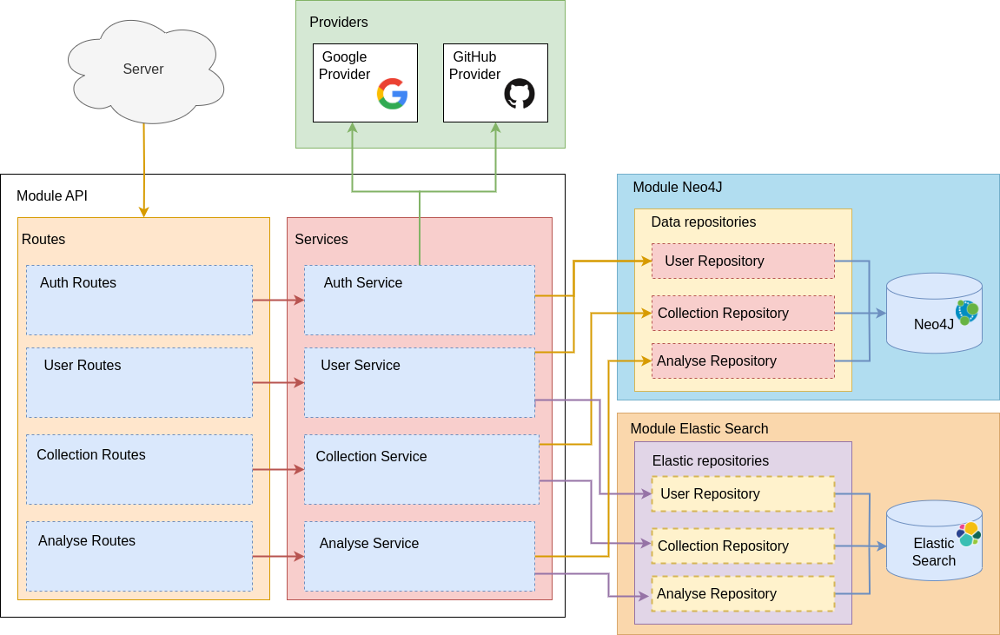

# Image Analyser Project

Server:
- Neo4j module (OK)
- Elastic Search module (OK)
- API (OK)
- Auth
  - Google (OK)
  - Github (OK)
- Sonarqube (OK)
- CI/CD (OK)
- Tests (TODO)
- Cron job to sync neo4j and elastiic (TODO)

Client:
- API (WIP)
- UI (to be reused & extended)
- ML-module (to be reused)
- Localisation (TODO)
